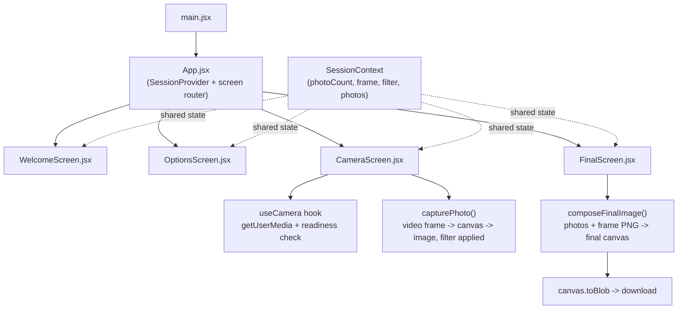
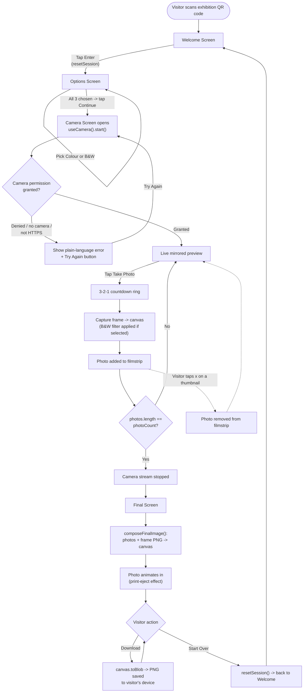

# Tawang Photobooth — System Design & Appearance Overview (v2 — React)

Read this file first. It explains **what we are building and why**, before you look at a single line of code.

> Companion files:
> - [TECH_STACK_AND_FLOWS.md](TECH_STACK_AND_FLOWS.md) — what technology is used, why, and how the screens/logic work.
> - [README.md](README.md) — the one file with setup / run / debug / deploy steps.

> **v2 update:** the project was rebuilt from plain HTML/CSS/JS to **React + Vite** at your request, for better code quality and maintainability. This version also fixes a real bug found in the v1 build (the camera preview could get stuck hidden behind an error panel after granting permission) and uses a fresh visual design — see Section 6.

---

## 1. What this project is

A **mobile web photobooth** for the Tawang exhibition. A visitor scans a QR code at the installation, opens the page on their own phone, picks a photo layout + frame + filter, takes photos with their camera, and downloads a final framed image. There is **no login, no backend server, and no database** — everything happens inside the visitor's browser.

This matches the brief in `Tawang_Photobooth_Requirements.docx` and the client conversation in `conversationWithClinet.txt`.

> **Note on the Figma link:** the shared Figma board (`figma.com/board/2pieXkSFWXR0fK3XdylG3E/...`) could not be opened by the agent building this (Figma's board viewer requires WebGL/interactive login and cannot be fetched as a document). Nothing in this project was guessed to compensate — instead, the actual exported design assets you provided (in `photobooth assets.zip`) were inspected directly (including reading transparency data inside the frame PNGs) to figure out exactly where each photo should sit inside each frame. If you get Figma access working, compare it against Section 5 below and tell us what to correct — do not assume the current numbers are final.

---

## 2. Guiding principles (why it's built this way)

1. **React + Vite**, chosen deliberately for this v2: component-based structure (one file per screen), a fast local dev server with instant reload, and a standard, well-documented toolchain. This does mean `npm install` is now required (see the tradeoff note in Section 7 and the setup steps in [README.md](README.md)).
2. **No external services or paid APIs.** Camera, photo capture, filters, frame compositing, and download all happen with built-in browser features (`getUserMedia`, `<canvas>`, `Blob`) — this did not change.
3. **Everything stays on the visitor's device.** No photo is ever uploaded anywhere.
4. **One shared session state** (now a small React Context instead of a plain object) drives the whole app.
5. **Deployable for free** on GitHub Pages (build step produces static files, same free HTTPS hosting as before).

---

## 3. Screen-by-screen appearance design (v2 visual direction)

The visual identity still comes from the supplied exhibition assets (Thangka-style motifs, Tawang monastery gate photo, prayer flags, vintage camera illustration) — those images were not changed. The **surrounding UI chrome** (typography, color palette, cards, buttons, spacing, motion) was redesigned for this version, since you asked for a fresh look rather than sticking to the v1 pattern:

- **Palette:** deep charcoal/ink base with warm gold and maroon accents (a "museum-at-night" feel) instead of v1's flat cream cards.
- **Typography:** a serif display face for headings (cultural/ceremonial feel) paired with a clean grotesque for body/UI text.
- **Cards & depth:** soft elevated panels with rounded corners and subtle shadows instead of flat sections.
- **Motion:** small, deliberate transitions (fade/slide between screens, a circular countdown ring instead of plain digits, a smoother "print eject" animation on the Final screen).

Layout remains **portrait-first**, reference viewport **390×844px**, no horizontal scrolling, scales to other phone sizes.

### Screen 1 — Welcome
- Prayer flags graphic across the top, Tawang gate as the hero image, mountain midground anchored to the bottom (same assets as v1, restyled framing/spacing).
- Title + short intro line + single primary **Enter** button.
- No camera permission requested here.

### Screen 2 — Options / Setup
- Three grouped cards: **Number of photos** (2/3/4), **Frame style** (4 previews, matching the chosen count), **Filter** (Colour / Black & White).
- Sticky **Continue** button, disabled until all three are chosen.

### Screen 3 — Camera
- Live camera preview (mirrored, front camera), height-capped so the capture button is always reachable without scrolling on any phone size (this cap is also part of the camera-bug fix — see Section 4).
- Circular countdown ring (3‑2‑1) over the preview before each shot.
- Filmstrip of captured thumbnails with a retake/delete control each.
- Plain-language error state (permission denied / no camera / insecure connection) with a retry action — and now, because React only *renders* this panel when there's an actual error (instead of hiding/showing it with CSS), it is structurally impossible for it to cover the live preview by mistake.

### Screen 4 — Final / Print
- Camera illustration anchors the screen; the finished composite animates in as if sliding out of the camera.
- **Download** (saves PNG) and **Start Over** (resets session, stops camera) actions.

---

## 4. The v1 camera bug, and how the React rebuild fixes it structurally

**What was happening:** in the old plain-CSS build, the error panel and the countdown overlay were toggled using the HTML `hidden` attribute from JavaScript, but a CSS rule elsewhere in the stylesheet (`display: flex` on those same elements, added for when they *are* shown) had equal specificity to the browser's built-in `[hidden] { display: none }` rule. That let the "camera error" panel stay visibly stuck on top of the live video permanently, regardless of whether there actually was an error — so after granting camera permission, visitors would see a black box with a "Try again" button instead of their live preview, and it looked like the capture button did nothing.

**Why this cannot happen in the React version:** instead of toggling a CSS class/attribute on an always-present DOM element, the error panel and the countdown ring are only **conditionally rendered** at all — e.g. `{status === 'error' && <CameraErrorPanel .../>}`. When there's no error, that element does not exist in the page, so there is no CSS rule that could possibly keep it visible by mistake. This is a structural fix, not just a patched style rule.

Two more robustness fixes carried over from the debugging session, now implemented inside the `useCamera` hook (see [TECH_STACK_AND_FLOWS.md](TECH_STACK_AND_FLOWS.md)):
- The camera is only considered "ready" once the video element reports real frame dimensions (`videoWidth`/`videoHeight` > 0), not just as soon as `play()` resolves — some phone browsers resolve `play()` a moment before real frames exist.
- Capturing a photo before the video is truly ready throws a clear, caught error (shown to the visitor with a retry) instead of silently producing a broken image.

---

## 5. Frame composition design (how photos land inside a frame)

Each frame is a transparent-background PNG (666×375px canvas) with the decorative Thangka-style border art baked in, and "holes" (fully transparent pixels) where the visitor's photos should show through.

Because Figma could not be opened, these hole positions were measured **directly from the actual PNG alpha channel** of the assets you supplied (not guessed). The composition draws the captured photo(s) first, then draws the frame PNG on top, so the decorative art (branch, tiger, etc.) naturally overlaps the photo edges exactly as designed.

Measured slot geometry (as a percentage of the frame's 666×375 canvas — used identically for all 4 frame styles at a given photo count):

| Photo count | Slot X (left) | Slot width | Row tops (top %) | Row height |
|---|---|---|---|---|
| 2 | 73.0% | 20.5% | 7.2%, 28.2% | 19.3% |
| 3 | 18.3% | 20.5% | 7.2%, 28.3%, 49.2% | 19.3% |
| 4 | 46.8% | 20.5% | 7.2%, 28.3%, 49.2%, 70.1% | 19.3% |

These constants live in one place in the code (`src/data/frames.js`) so they are easy to correct later if you obtain the exact Figma values.

---

## 6. High-level architecture (React)

There is no routing library — with only 4 screens in one linear flow, the current screen is just a value in the shared session state (`'welcome' | 'options' | 'camera' | 'final'`), and `App.jsx` renders the matching component. This avoids an unnecessary dependency (`react-router`) for a 4-screen app.

---

## 7. What changed vs. the v1 (plain HTML/CSS/JS) build — and the tradeoff

| | v1 | v2 (this version) |
|---|---|---|
| Stack | Plain HTML/CSS/JS, no build step | React + Vite, `npm install` + build step required |
| Run locally | Open a static server (or Live Server extension) | `npm install` once, then `npm run dev` |
| Deploy | Copy files as-is to GitHub Pages | `npm run build` produces a `dist/` folder, which is what gets deployed |
| Code organization | Separate `.js` files per concern | React components + hooks, one file per screen |
| Camera bug | Present (CSS specificity issue) | Fixed structurally (conditional rendering) |

**Tradeoff called out explicitly:** the original v1 brief asked for *no build tools* specifically so a design student could run the project without needing much technical setup. Moving to React reintroduces a build step (Node.js + npm). This was done because you explicitly asked for the React migration in this session. The [README.md](README.md) setup steps have been updated accordingly (Node.js is now a required install, not optional).

- No account/login, no analytics, no cloud upload, no external paid API — this did not change.

---

## 8. User Flow Diagram

This is the full visitor journey end-to-end, including the error/retake/restart branches (not just the "happy path"):

