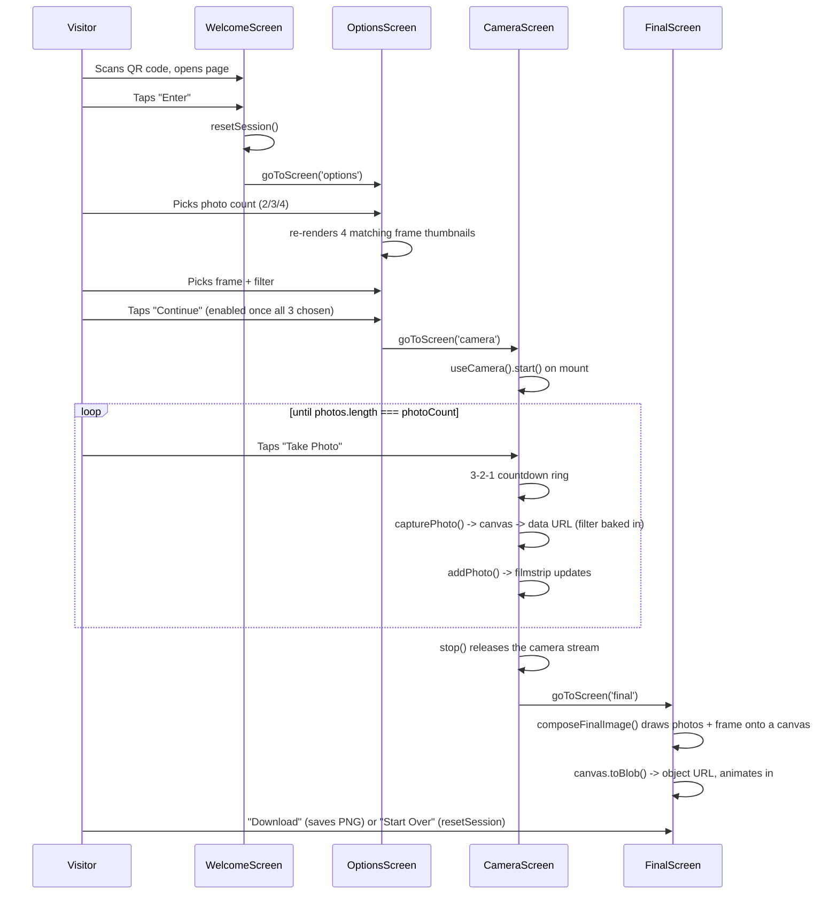

# Tech Stack & App Flows — Tawang Photobooth (v2 — React)

This file explains **what technology this project uses, why each piece was chosen, and how data flows through the four screens.** Read [SYSTEM_DESIGN.md](SYSTEM_DESIGN.md) first for the visual/product overview.

---

## 1. Tech stack

| Technology | Purpose | Why this |
|---|---|---|
| **React 18** | Component-based UI (one component per screen) | Requested for this v2 rebuild — component structure, hooks, and conditional rendering make the code easier to reason about and fixed a real CSS bug from v1 (see Section 4). |
| **Vite** | Local dev server + production build tool | The standard, fast, low-config way to run a React app. `npm run dev` gives instant reload; `npm run build` produces a small static `dist/` folder for hosting. |
| **CSS Modules** (`*.module.css`) | Component-scoped styling | Each component's class names are automatically scoped, so styles never leak between screens/components — no manual naming conventions needed. |
| **React Context + `useReducer`** | Shared session state (photo count, frame, filter, photos, current screen) | Small, built into React, no extra state-management library needed for an app this size. |
| **`navigator.mediaDevices.getUserMedia`** | Access the phone's front camera | Native browser API — no paid service required. |
| **`<canvas>` + Canvas 2D API** | Capture a still photo from video, apply the Black & White filter, and composite the final framed image | Built into every modern browser. |
| **`canvas.toBlob()` + `URL.createObjectURL()`** | Turn the finished composite into a downloadable PNG | Native browser APIs, no upload/server required. |
| **GitHub Pages** | Free static hosting with automatic HTTPS | Camera access requires a secure context; GitHub Pages provides that for free. |

**What is NOT used, on purpose:** no router library (only 4 screens, handled by a simple value in shared state — see Section 3), no animation library (plain CSS transitions + one small inline-style-driven animation are enough), no UI component library (keeps the bundle small and the design fully custom).

### The tradeoff of moving to React (please read)

The original v1 brief asked for **no build tools** so a design student could run the project with minimal technical setup. React (via Vite) requires **Node.js and `npm install`** — there is no way around this if using React. This version was built because it was explicitly requested. See [README.md](README.md) for the updated setup steps (Node.js is now a required install).

---

## 2. Project structure

```
index.html                 Vite entry point (loads /src/main.jsx)
vite.config.js              Vite config (base: './' for portable deployment)
package.json                 Scripts: dev / build / preview
public/assets/               Static images copied as-is into every build (frames, welcome art, camera graphic)
src/
  main.jsx                   Mounts <App/> into #root
  App.jsx                     Wraps everything in SessionProvider, renders the current screen
  state/
    SessionContext.jsx         React Context + reducer holding all shared session data
  hooks/
    useCamera.js                Camera start/stop/readiness as a reusable hook
  utils/
    capturePhoto.js              Video frame -> canvas -> PNG data URL (+ B&W filter)
    composeFinalImage.js          Captured photos + frame PNG -> final canvas
    publicAsset.js                 Builds a correct URL to a file in /public regardless of deployment path
  data/
    frames.js                        Frame style list + measured photo-slot geometry
  components/
    Button.jsx / .module.css           Reusable primary/secondary button
    ScreenShell.jsx / .module.css       Shared phone-width screen container
  screens/
    WelcomeScreen.jsx / .module.css
    OptionsScreen.jsx / .module.css
    CameraScreen.jsx / .module.css
    FinalScreen.jsx / .module.css
  styles/
    global.css                          Design tokens (colors, fonts), resets
```

---

## 3. The shared session state

`src/state/SessionContext.jsx` holds one object for the whole app:

```js
{
  screen: 'welcome',     // 'welcome' | 'options' | 'camera' | 'final'
  photoCount: null,      // 2 | 3 | 4
  frame: null,           // 'frame1' | 'frame2' | 'frame3' | 'frame4'
  filter: 'colour',      // 'colour' | 'blackAndWhite'
  photos: []             // [{ id, imageData, timestamp }, ...]
}
```

`App.jsx` reads `session.screen` and renders the matching screen component — this is the entire "router". Any screen can call `goToScreen('...')` (from `useSession()`) to navigate; there is no separate routing library because a 4-screen linear flow doesn't need one.

---

## 4. The v1 camera bug, and why it can't happen anymore

In the v1 (plain CSS) build, the camera error panel and countdown overlay were toggled with the `hidden` HTML attribute, but a CSS rule elsewhere gave those same elements `display: flex` with equal specificity — so the browser's own `[hidden] { display: none }` rule sometimes lost, and the error panel stayed visibly stuck over the live video permanently.

In `src/screens/CameraScreen.jsx`, that whole class of bug is now structurally impossible, because the error panel and the countdown ring are **conditionally rendered**, not hidden/shown via CSS:

```jsx
{status === 'error' && (
  <div className={styles.errorPanel}>...</div>
)}
```

When there's no error, that `<div>` does not exist anywhere in the page — there is no CSS rule anywhere that could keep a nonexistent element visible.

The `useCamera` hook (`src/hooks/useCamera.js`) also:
- Waits for the video element to report real frame dimensions before marking the camera "ready" (some phone browsers resolve `.play()` a moment before real frames exist).
- Uses a request-id guard so React's development-mode double-invoke of effects (which intentionally runs setup → cleanup → setup once, to help catch bugs) can never leave two camera streams running or attach a stale stream to the video element.

---

## 5. Screen-by-screen flow



### WelcomeScreen
Calls `resetSession()` so a new visitor always starts clean, then navigates to Options. No camera permission requested here.

### OptionsScreen
Renders 3 cards. The frame thumbnails re-render whenever `photoCount` changes (`useMemo` keyed on it), because each frame style has a different image per photo count. "Continue" is disabled until `photoCount`, `frame`, and `filter` are all set.

### CameraScreen
- `useCamera()` starts the camera when the screen mounts, and is guaranteed to stop it when the screen unmounts (cleanup effect inside the hook).
- Tapping "Take Photo" starts a 3-second countdown (rendered as an animated ring), then calls `capturePhoto()`, which draws the current frame onto an offscreen canvas — applying `ctx.filter = 'grayscale(100%)'` first if Black & White was chosen.
- Each captured photo appears in a filmstrip with a "×" retake/delete button.
- Once `photos.length` reaches `photoCount`, the camera is stopped and the Final screen is shown.

### FinalScreen
- `composeFinalImage()` draws each captured photo into its frame slot (cropped proportionally, never stretched), then draws the frame PNG on top, onto one canvas.
- The canvas becomes a PNG blob, shown as an ``. The "ejecting from the camera" animation is driven by a React state flag (`ejected`) applied as **inline styles** (not a CSS class) — this sidesteps any possible CSS specificity conflict entirely, guaranteeing the animation always plays.
- "Download" saves the PNG. "Start Over" resets the session and returns to Welcome.

---

## 6. Where the frame photo-slot positions come from

See [SYSTEM_DESIGN.md § 5](SYSTEM_DESIGN.md#5-frame-composition-design-how-photos-land-inside-a-frame) — these values live in `src/data/frames.js` (`FRAME_SLOTS`) and were measured from the actual frame PNGs' transparency data, since the Figma board could not be opened. If you get exact numbers from Figma later, that is the only file you need to update.

---

## 7. How to extend this project

- **Add a 5th frame style:** drop `frame5-2.png`, `frame5-3.png`, `frame5-4.png` into `public/assets/frames/`, and add `'frame5'` to `FRAME_STYLES` in `src/data/frames.js`.
- **Change countdown length:** edit `COUNTDOWN_SECONDS` at the top of `src/screens/CameraScreen.jsx`.
- **Change colours/fonts:** edit the CSS custom properties at the top of `src/styles/global.css` (`:root { --gold: ...; }` etc.).
- **Known dependency note:** `npm audit` may report a moderate/high advisory in `esbuild` (a dependency of Vite's dev server). This only affects the local dev server (not the deployed production build) and is a known, narrow-risk issue where another local process/tab could probe the dev server. Run `npm audit` periodically; upgrading to a newer major version of Vite resolves it if you want to address it, but wasn't done automatically here to avoid an untested breaking change.

